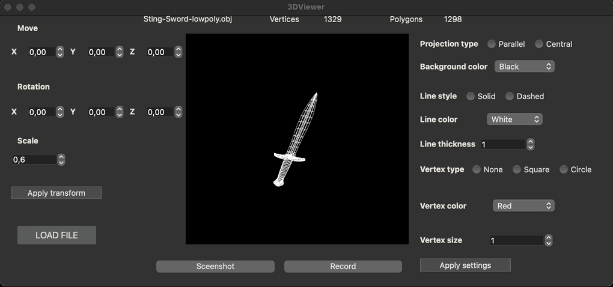

# 3DViewer v1.0 Implementation Summary

**3DViewer v1.0**, a program for visualizing 3D wireframe models, has been successfully designed and implemented. The main technical features and attributes of the solution are outlined below:



## Installation:
````
git clone https://github.com/0xmisha/3dviewer_v1.0.git
cd 3dviewer_v1.0/src
make
````

## Requirements:

- Gcc
- CMake
- QT >=5.0
- check.h (for tests)

## Key Functionalities:

- **3D Model Loading**: Users can seamlessly load wireframe models from **.obj** files. This primarily supports vertices and surfaces list. The parsing mechanism meticulously extracts 3D object details from .obj files to visualize them within the program.

- **Affine Transformations**:
  - **Translation**: Models can be translated across the X, Y, and Z axes.
  - **Rotation**: The software allows rotation relative to the model's X, Y, and Z axes.
  - **Scaling**: Users can scale the 3D models with precision.

- **GUI Features**:
  - Model selection and naming.
  - A dedicated area for wireframe model visualization.
  - Intuitive buttons and fields for translation, rotation, and scaling tasks.
  - Concise model information display including file name, vertex count, and edge count.
  
- **Performance**: This tool is optimized to handle models with vertices ranging from 100 to a staggering 1,000,000 without any performance lag.

## Bonus Features:

- **Custom Settings**: 
  - Projection types like parallel and central.
  - Varied display customizations, including edge type, color, and thickness. Moreover, vertex displays can be adjusted (none, circle, square) along with their colors and sizes.
  - Background color flexibility for enhanced visualization.
  - Settings persistence across software restarts.

- **Recording Abilities**: 
  - Capture & Save: Rendered 3D models can be saved as BMP and JPEG files.
  - Screencasts: Users can record custom affine transformations of loaded models into gif-animations with specifications of 640x480 resolution, 10fps, and a 5-second duration.

## Technical Overview:

- **Language & Compiler**: The software is crafted using the **C11** standard of the C language, compiled using the gcc compiler.
  
- **Code & Building**: Consistent organization of the program's code is maintained in the `src` directory. A `Makefile` aids the build process, covering an array of targets: all, install, uninstall, clean, dvi, dist, tests, and gcov.

- **Structured Programming & Style**: Following the principles of structured programming, the code has been structured for simplicity and clarity. It also adheres to the Google style guide to ensure maintainability.

- **GUI**: The graphical user interface, pivotal for user interaction, is constructed using the **Qt** library, both for Linux and Mac systems.

This comprehensive software solution, while rooted in core C programming, offers advanced 3D visualization and manipulation capabilities, aiming to revolutionize the way users interact with 3D wireframe models.